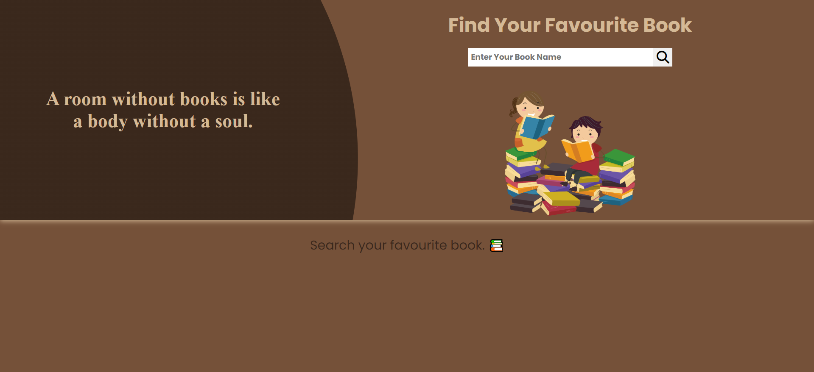
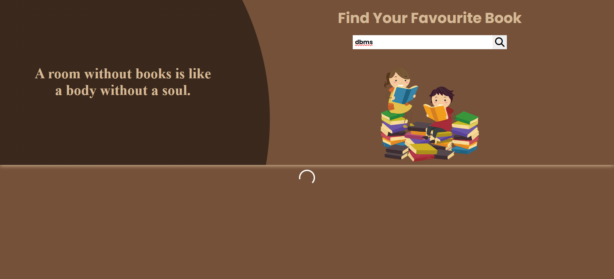
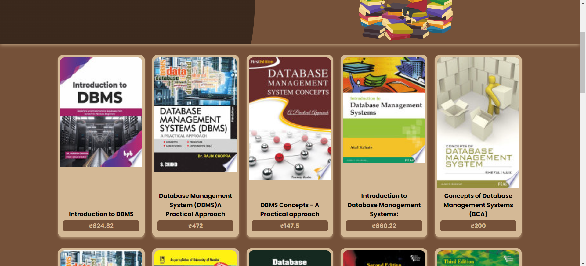
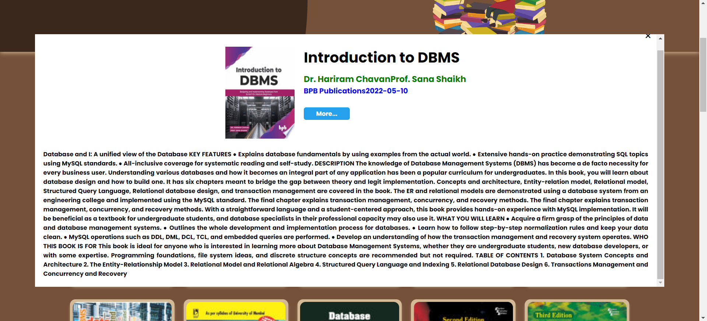

# Book Search Application

A web application built with React that allows users to search for books using the Google Books API.

## Screenshots

*Front page*

*Loading the books*

*Book List*

*Detail of book*

## Features

- Search for books by title.
- View book details including title, author, and thumbnail.
- Responsive design for mobile and desktop.
